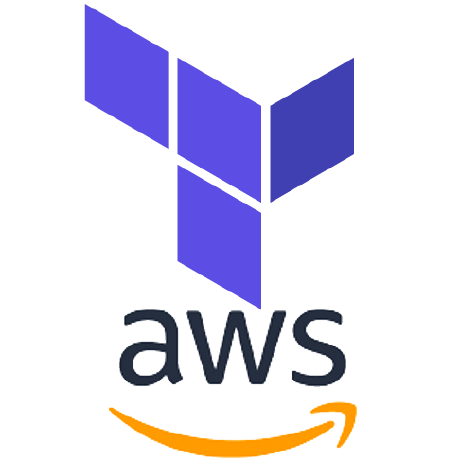

[![Contributors][contributors-shield]][contributors-url]
[![Forks][forks-shield]][forks-url]
[![Stargazers][stars-shield]][stars-url]
[![Issues][issues-shield]][issues-url]
[![GPL3 License][license-shield]][license-url]
[![LinkedIn][linkedin-shield]][linkedin-url]
[![Ask Me Anything][ask-me-anything]][personal-page]

<!-- PROJECT LOGO -->
<br />
<p align="center">
<div class="row">
  <div class="column" align="center">
  
    
  </div>
  <div class="column">
    
  </div>
</div>

<h3 align="center">golang_security_group_checker</h3>

  <p align="center">
    Golang script to monitor specific AWS Security group CIDR and store those in a DynamoDB table.
    <br />
    <br />
  </p>
</p>

<!-- TABLE OF CONTENTS -->

## Table of Contents

- [Table of Contents](#table-of-contents)
- [About The Project](#about-the-project)
  - [Built With](#built-with)
- [Getting Started](#getting-started)
  - [Prerequisites](#prerequisites)
  - [Installation](#installation)
- [Usage](#usage)
- [Roadmap](#roadmap)
- [Contributing](#contributing)
- [License](#license)
- [Contact](#contact)
- [Acknowledgements](#acknowledgements)

<!-- ABOUT THE PROJECT -->

## About The Project

At the moment there's only one hardcoded criteria, which is "0.0.0.0/0". The idea is to convert it into something more flexible to accept other kinds of inputs. The terraform module that this project consumes was also written by me to easily deploy a AWS lambda and a DynamoDB table with all the required permissions for the former to access the latter.


### Built With

- Terraform
- Golang (runtime go1.x)
- AWS services (DynamoDB, IAM, Lambda, Cloudwatch)


---

<!-- GETTING STARTED -->

## Getting Started


### Prerequisites

- Terraform: Deployed with version 1.0.6


### Installation

- Install Terraform
> https://learn.hashicorp.com/tutorials/terraform/install-cli
- Install AWS cli and configure your AWS credentials (you should have a AWS account already)
> https://docs.aws.amazon.com/cli/latest/userguide/getting-started-install.html
> 
> https://docs.aws.amazon.com/cli/latest/userguide/getting-started-quickstart.html

---

<!-- USAGE EXAMPLES -->

## Usage

The whole solution will be deployed via terraform

```bash
terraform init
terraform plan
terraform apply 
```

There's a locals block in the *main.tf* file to modify a couple of fields that are consumed by several parts of the project. The *table name*, *attribue name* for that table and *schedule expression* that defines the rate of how frequent the Cloudwatch event rule executes the lambda function.

---

<!-- ROADMAP -->

## Roadmap

See the [open issues](https://github.com/not-existing-organization/terraform_module_security_group_checker/raw/main/issues) for a list of proposed features (and known issues).

---

<!-- CONTRIBUTING -->

## Contributing

Contributions are what make the open source community such an amazing place to be learn, inspire, and create. Any contributions you make are **greatly appreciated**.

1. Fork the Project
2. Create your Feature Branch (`git checkout -b feature/AmazingFeature`)
3. Commit your Changes (`git commit -m 'Add some AmazingFeature'`)
4. Push to the Branch (`git push origin feature/AmazingFeature`)
5. Open a Pull Request

---

<!-- LICENSE -->

## License

Distributed under the GPL-3.0 License. See `LICENSE` for more information.

<!-- CONTACT -->

## Contact

Santiago - elfmg1@gmail.com

---

<!-- ACKNOWLEDGEMENTS -->

## Acknowledgements

- [GitHub Emoji Cheat Sheet](https://www.webpagefx.com/tools/emoji-cheat-sheet)
- [Img Shields](https://shields.io)
- [Choose an Open Source License](https://choosealicense.com)
- [GitHub Pages](https://pages.github.com)

<!-- MARKDOWN LINKS & IMAGES -->
<!-- https://www.markdownguide.org/basic-syntax/#reference-style-links -->

[contributors-shield]: https://img.shields.io/github/contributors/not-existing-organization/terraform_module_security_group_checker.svg?style=for-the-badge
[contributors-url]: https://github.com/not-existing-organization/terraform_module_security_group_checker/graphs/contributors
[forks-shield]: https://img.shields.io/github/forks/not-existing-organization/terraform_module_security_group_checker.svg?style=for-the-badge
[forks-url]: https://github.com/not-existing-organization/terraform_module_security_group_checker/network/members
[stars-shield]: https://img.shields.io/github/stars/not-existing-organization/terraform_module_security_group_checker.svg?style=for-the-badge
[stars-url]: https://github.com/not-existing-organization/terraform_module_security_group_checker/stargazers
[issues-shield]: https://img.shields.io/github/issues/not-existing-organization/terraform_module_security_group_checker.svg?style=for-the-badge
[issues-url]: https://github.com/not-existing-organization/terraform_module_security_group_checker/issues
[license-shield]: https://img.shields.io/github/license/not-existing-organization/terraform_module_security_group_checker?style=for-the-badge
[license-url]: https://github.com/not-existing-organization/terraform_module_security_group_checker/blob/master/LICENSE.txt
[linkedin-shield]: https://img.shields.io/badge/-LinkedIn-black.svg?style=for-the-badge&logo=linkedin&colorB=555
[linkedin-url]: https://www.linkedin.com/in/santiago-delcampo/
[product-screenshot]: .assets/screenshot.png
[ask-me-anything]: https://img.shields.io/badge/Ask%20me-anything-1abc9c.svg?style=for-the-badge
[personal-page]: https://github.com/not-existing-organization
